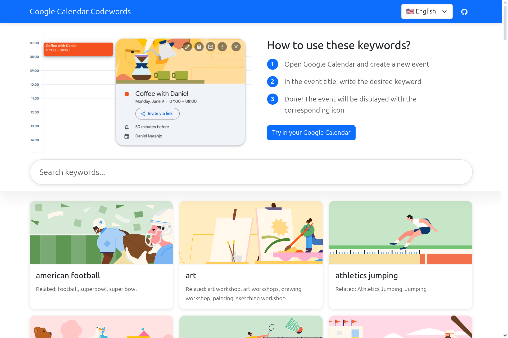

# Google Calendar Codewords




A web application that allows users to explore and search through Google Calendar event keywords and their related terms. The application supports multiple languages and features a modern, responsive design.

## Features

- 🔍 Keyword search with real-time filtering
- 🌐 Multi-language support
- 📱 Responsive design for all devices
- ⏳ Lazy loading for optimized performance

## Setup

1. Clone the repository:
```bash
git clone [repository-url]
cd google-calendar-codewords
```

2. Open your browser and navigate to the `index.html` file in the project directory.

## Project Structure

```
google-calendar-codewords/
├── css/
│   └── styles.css          # Application styles
├── js/
│   └── app.js              # Main application logic
├── locales/
│   ├── keywords/
│   │   ├── en.json        # English keywords
│   │   └── es.json        # Spanish keywords
│   └── translations/
│       ├── en.json        # English translations
│       └── es.json        # Spanish translations
├── images/                # Image files
└── index.html             # Main HTML file
```

## Technologies Used

- HTML5
- CSS3
- JavaScript (ES6+)
- Bootstrap 5
- i18next for internationalization

## Keywords
Add new keywords by modifying the JSON files in the `locales/keywords` directory. Each keyword should have the following structure:

```json
{
  "keyword": "valentines day",
  "related": ["valentine's day", "valentines"],
  "slug": "valentinesday"
},
```

## Contributing

1. Fork the repository
2. Create your feature branch (`git checkout -b feature/missing-keywords`)
3. Commit your changes (`git commit -m 'Add some missing keywords'`)
4. Push to the branch (`git push origin feature/missing-keywords`)
5. Open a Pull Request

## License

This project is licensed under the MIT License. See the [LICENSE](./LICENSE) file for details.

## Acknowledgments

- Google Calendar for providing the event illustrations
- i18next for internationalization support
- Bootstrap for the responsive framework
